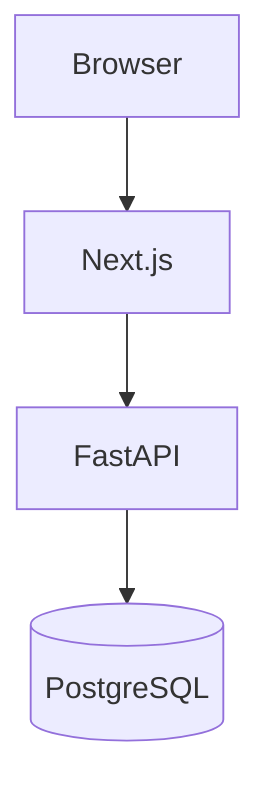

# Markdown Polish Implementation Plan

> **For agentic workers:** REQUIRED SUB-SKILL: Use superpowers:subagent-driven-development (recommended) or superpowers:executing-plans to implement this plan task-by-task. Steps use checkbox (`- [ ]`) syntax for tracking.

**Goal:** Upgrade the post/answer/comment rendering pipeline with syntax-highlighted code blocks (Pygments), LaTeX math (KaTeX via Node subprocess), and Mermaid diagrams (client-side lazy import).

**Architecture:** Hybrid server/client rendering. `renderer.py` is extended to produce highlighted code via Pygments and rendered math via a KaTeX Node helper script at write time — readers get zero-JS output. Mermaid diagrams render client-side via dynamic `import("mermaid")` to avoid a Chromium dependency on the backend. A new `<RichContent>` component replaces raw `dangerouslySetInnerHTML` at all display points to handle Mermaid mounting.

**Tech Stack:** Pygments (Python), KaTeX (Node helper script), Mermaid (npm, browser-side), React/TypeScript

## Global Constraints

- All backend code uses the `syntrix` schema — no other schemas touched
- Python 3.12+, ruff lint rules enforced
- Tests live next to the code they test (`backend/app/foo/tests/test_foo.py`)
- Frontend uses CSS modules + CSS variables (no Tailwind)
- No database migration needed — `body_html` column unchanged
- Editor (TipTap) unchanged — lowlight stays for live editing
- Run `cd backend && uv run pytest -v` for backend tests
- Run `cd frontend && npm run lint` for frontend lint

---

## File Structure

### Backend — modified files
- `backend/pyproject.toml` — add `pygments` dependency
- `backend/app/posts/renderer.py` — Pygments code highlighting + KaTeX math parsing in text nodes
- `backend/app/posts/tests/test_renderer.py` — new tests for highlighting, math, and mermaid passthrough

### Scripts — new files
- `scripts/package.json` — `katex` npm dependency
- `scripts/render-katex.mjs` — Node helper: reads JSON array of LaTeX strings from stdin, returns JSON array of rendered HTML

### Frontend — new files
- `frontend/components/RichContent.tsx` — replaces `dangerouslySetInnerHTML`, mounts Mermaid blocks
- `frontend/components/RichContent.module.css` — Mermaid loading/error states
- `frontend/app/pygments-theme.css` — Pygments token colors for dark code blocks
- `frontend/app/katex-fonts.css` — `@font-face` declarations for KaTeX fonts
- `frontend/public/fonts/katex/` — KaTeX font files (woff2)

### Frontend — modified files
- `frontend/app/layout.tsx` — import `pygments-theme.css` and `katex-fonts.css`
- `frontend/app/(app)/c/[slug]/post/[id]/page.tsx` — use `<RichContent>` instead of `dangerouslySetInnerHTML`
- `frontend/app/(app)/c/[slug]/post/[id]/AnswerCard.tsx` — use `<RichContent>` instead of `dangerouslySetInnerHTML`
- `frontend/app/(app)/c/[slug]/post/[id]/CommentNode.tsx` — use `<RichContent>` instead of `dangerouslySetInnerHTML`
- `frontend/package.json` — add `mermaid` dependency

---

### Task 1: Pygments Code Highlighting in renderer.py

**Files:**
- Modify: `backend/pyproject.toml`
- Modify: `backend/app/posts/renderer.py`
- Modify: `backend/app/posts/tests/test_renderer.py`

**Interfaces:**
- Consumes: existing `render_tiptap_json(doc: dict) -> str` API (unchanged signature)
- Produces: `render_tiptap_json` now emits `<pre class="highlight"><code>` with Pygments `<span>` tokens for code blocks; unchanged output for all other node types

- [ ] **Step 1: Add pygments dependency**

```bash
cd backend && uv add pygments
```

Verify it installs without errors.

- [ ] **Step 2: Write failing tests for highlighted code blocks**

Add these tests to `backend/app/posts/tests/test_renderer.py`:

```python
def test_code_block_highlighted():
    """Pygments should produce span tokens for known languages."""
    doc = {
        "type": "doc",
        "content": [
            {
                "type": "codeBlock",
                "attrs": {"language": "python"},
                "content": [{"type": "text", "text": "def hello():\n    pass"}],
            }
        ],
    }
    html = render_tiptap_json(doc)
    assert '<pre class="highlight">' in html
    assert "<span" in html
    assert "def" in html
    assert "hello" in html


def test_code_block_unknown_language():
    """Unknown languages fall back to plain text, no crash."""
    doc = {
        "type": "doc",
        "content": [
            {
                "type": "codeBlock",
                "attrs": {"language": "notareallang"},
                "content": [{"type": "text", "text": "some code"}],
            }
        ],
    }
    html = render_tiptap_json(doc)
    assert '<pre class="highlight">' in html
    assert "some code" in html


def test_code_block_no_language():
    """Code blocks with no language get plain rendering."""
    doc = {
        "type": "doc",
        "content": [
            {
                "type": "codeBlock",
                "attrs": {},
                "content": [{"type": "text", "text": "plain text"}],
            }
        ],
    }
    html = render_tiptap_json(doc)
    assert '<pre class="highlight">' in html
    assert "plain text" in html


def test_code_block_xss_in_language():
    """Language attr with XSS payload must not inject HTML."""
    doc = {
        "type": "doc",
        "content": [
            {
                "type": "codeBlock",
                "attrs": {"language": '"><script>alert(1)</script>'},
                "content": [{"type": "text", "text": "x"}],
            }
        ],
    }
    html = render_tiptap_json(doc)
    assert "<script>" not in html
```

- [ ] **Step 3: Run tests to verify they fail**

```bash
cd backend && uv run pytest app/posts/tests/test_renderer.py -v -k "highlight or unknown_language or no_language or xss_in_language"
```

Expected: FAIL — old renderer emits `<pre><code class="language-...">` not `<pre class="highlight">`.

- [ ] **Step 4: Implement Pygments highlighting in renderer.py**

Replace the `codeBlock` handler in `backend/app/posts/renderer.py`. Add the import at the top and replace the `if t == "codeBlock":` block:

Add to imports at top of file:

```python
from pygments import highlight as pygments_highlight
from pygments.formatters import HtmlFormatter
from pygments.lexers import get_lexer_by_name, TextLexer
from pygments.util import ClassNotFound
```

Replace the `codeBlock` block (lines 54-58) with:

```python
    if t == "codeBlock":
        lang = attrs.get("language", "") or ""
        code_text = _extract_text(content)
        try:
            lexer = get_lexer_by_name(lang) if lang else TextLexer()
        except ClassNotFound:
            lexer = TextLexer()
        formatter = HtmlFormatter(nowrap=True)
        highlighted = pygments_highlight(code_text, lexer, formatter)
        return f'<pre class="highlight"><code>{highlighted}</code></pre>'
```

Add a helper function after `_render_nodes`:

```python
def _extract_text(nodes: list[dict]) -> str:
    """Extract raw text from TipTap content nodes (used for code blocks)."""
    parts: list[str] = []
    for node in nodes:
        if node.get("type") == "text":
            parts.append(node.get("text", ""))
        elif "content" in node:
            parts.append(_extract_text(node["content"]))
    return "".join(parts)
```

Note: `_extract_text` extracts raw text without HTML escaping — Pygments handles its own escaping. This replaces `_render_nodes` for code blocks so we don't double-escape.

- [ ] **Step 5: Update the existing test_code_block test**

The existing `test_code_block` test checks for `class="language-python"` which no longer applies. Update it:

```python
def test_code_block():
    doc = {
        "type": "doc",
        "content": [
            {
                "type": "codeBlock",
                "attrs": {"language": "python"},
                "content": [{"type": "text", "text": "print('hi')"}],
            }
        ],
    }
    html = render_tiptap_json(doc)
    assert '<pre class="highlight">' in html
    assert "print" in html
```

- [ ] **Step 6: Run all renderer tests**

```bash
cd backend && uv run pytest app/posts/tests/test_renderer.py -v
```

Expected: all tests PASS.

- [ ] **Step 7: Run full test suite to check for regressions**

```bash
cd backend && uv run pytest -v
```

Expected: all tests PASS.

- [ ] **Step 8: Commit**

```bash
git add backend/pyproject.toml backend/uv.lock backend/app/posts/renderer.py backend/app/posts/tests/test_renderer.py
git commit -m "feat(renderer): syntax-highlight code blocks with Pygments"
```

---

### Task 2: KaTeX Math Rendering via Node Helper

**Files:**
- Create: `scripts/package.json`
- Create: `scripts/render-katex.mjs`
- Modify: `backend/app/posts/renderer.py`
- Modify: `backend/app/posts/tests/test_renderer.py`

**Interfaces:**
- Consumes: `render_tiptap_json(doc: dict) -> str` (from Task 1)
- Produces: text nodes containing `$...$` or `$$...$$` now emit KaTeX HTML; `render_tiptap_json` signature unchanged. New internal function `_render_math(expressions: list[dict]) -> list[str]` calls the Node helper.

- [ ] **Step 1: Create the KaTeX Node helper script**

```bash
ls scripts/ 2>/dev/null || true
```

Create `scripts/package.json`:

```json
{
  "name": "syntrix-scripts",
  "private": true,
  "type": "module",
  "dependencies": {
    "katex": "^0.16"
  }
}
```

Create `scripts/render-katex.mjs`:

```javascript
import katex from "katex";

const chunks = [];
for await (const chunk of process.stdin) chunks.push(chunk);
const input = JSON.parse(Buffer.concat(chunks).toString("utf-8"));

const results = input.map(({ latex, displayMode }) => {
  try {
    return {
      html: katex.renderToString(latex, {
        displayMode: Boolean(displayMode),
        throwOnError: false,
        output: "html",
      }),
      error: null,
    };
  } catch (e) {
    return { html: null, error: e.message };
  }
});

process.stdout.write(JSON.stringify(results));
```

Install dependencies:

```bash
cd scripts && npm install
```

- [ ] **Step 2: Test the Node helper directly**

```bash
echo '[{"latex": "x^2", "displayMode": false}]' | node scripts/render-katex.mjs
```

Expected: JSON array with one object containing an `html` key with KaTeX span output and `error: null`.

- [ ] **Step 3: Write failing tests for math rendering**

Add to `backend/app/posts/tests/test_renderer.py`:

```python
def test_inline_math():
    """$x^2$ should render to KaTeX HTML."""
    doc = {
        "type": "doc",
        "content": [
            {
                "type": "paragraph",
                "content": [{"type": "text", "text": "The formula $x^2$ is simple."}],
            }
        ],
    }
    html = render_tiptap_json(doc)
    assert "katex" in html.lower() or "math" in html.lower()
    assert "$x^2$" not in html
    assert "The formula" in html
    assert "is simple." in html


def test_block_math():
    """$$...$$  should render as display math."""
    doc = {
        "type": "doc",
        "content": [
            {
                "type": "paragraph",
                "content": [{"type": "text", "text": "$$\\sum_{i=1}^{n} i$$"}],
            }
        ],
    }
    html = render_tiptap_json(doc)
    assert "math-block" in html
    assert "$$" not in html


def test_escaped_dollar():
    r"""Escaped \$ should render as literal $."""
    doc = {
        "type": "doc",
        "content": [
            {
                "type": "paragraph",
                "content": [{"type": "text", "text": r"Price is \$5."}],
            }
        ],
    }
    html = render_tiptap_json(doc)
    assert "$5" in html
    assert "katex" not in html.lower()


def test_math_bad_latex():
    """Invalid LaTeX should render as error code block, not crash."""
    doc = {
        "type": "doc",
        "content": [
            {
                "type": "paragraph",
                "content": [{"type": "text", "text": "$\\invalid{$"}],
            }
        ],
    }
    html = render_tiptap_json(doc)
    assert "math-error" in html or "katex" in html.lower()
```

- [ ] **Step 4: Run tests to verify they fail**

```bash
cd backend && uv run pytest app/posts/tests/test_renderer.py -v -k "math or escaped_dollar"
```

Expected: FAIL — renderer doesn't parse `$...$` delimiters yet.

- [ ] **Step 5: Implement math rendering in renderer.py**

Add these imports at the top of `backend/app/posts/renderer.py`:

```python
import json
import re
import subprocess
from pathlib import Path
```

Add a module-level constant for the script path:

```python
_KATEX_SCRIPT = Path(__file__).resolve().parents[3] / "scripts" / "render-katex.mjs"
```

Add the math-parsing functions after `_extract_text`:

```python
_MATH_BLOCK = re.compile(r"\$\$(.+?)\$\$", re.DOTALL)
_MATH_INLINE = re.compile(r"(?<!\$)\$(?!\$)(.+?)(?<!\$)\$(?!\$)")
_ESCAPED_DOLLAR = re.compile(r"\\\$")


def _parse_math(text: str) -> list[dict]:
    """Find all math expressions in text, return list of {latex, displayMode, start, end}."""
    placeholder = "\x00ESCAPED_DOLLAR\x00"
    working = _ESCAPED_DOLLAR.sub(placeholder, text)

    spans: list[dict] = []
    for m in _MATH_BLOCK.finditer(working):
        spans.append({
            "latex": m.group(1).strip(),
            "displayMode": True,
            "start": m.start(),
            "end": m.end(),
        })
    for m in _MATH_INLINE.finditer(working):
        if any(s["start"] <= m.start() < s["end"] for s in spans):
            continue
        spans.append({
            "latex": m.group(1).strip(),
            "displayMode": False,
            "start": m.start(),
            "end": m.end(),
        })
    spans.sort(key=lambda s: s["start"])
    return spans


def _render_math_batch(expressions: list[dict]) -> list[str]:
    """Call the Node KaTeX helper to batch-render math expressions."""
    if not expressions:
        return []
    payload = json.dumps([
        {"latex": e["latex"], "displayMode": e["displayMode"]}
        for e in expressions
    ])
    try:
        result = subprocess.run(
            ["node", str(_KATEX_SCRIPT)],
            input=payload,
            capture_output=True,
            text=True,
            timeout=10,
        )
        if result.returncode != 0:
            return [
                f'<code class="math-error">{escape(e["latex"])}</code>'
                for e in expressions
            ]
        items = json.loads(result.stdout)
        rendered: list[str] = []
        for item, expr in zip(items, expressions):
            if item.get("error") or not item.get("html"):
                rendered.append(f'<code class="math-error">{escape(expr["latex"])}</code>')
            elif expr["displayMode"]:
                rendered.append(f'<div class="math-block">{item["html"]}</div>')
            else:
                rendered.append(item["html"])
        return rendered
    except (subprocess.TimeoutExpired, FileNotFoundError, json.JSONDecodeError):
        return [
            f'<code class="math-error">{escape(e["latex"])}</code>'
            for e in expressions
        ]


def _apply_math_to_text(text: str) -> str:
    """Replace $...$ and $$...$$ in a plain text string with rendered KaTeX HTML."""
    placeholder = "\x00ESCAPED_DOLLAR\x00"
    working = _ESCAPED_DOLLAR.sub(placeholder, text)

    spans = _parse_math(text)
    if not spans:
        return working.replace(placeholder, "$")

    rendered = _render_math_batch(spans)

    parts: list[str] = []
    prev_end = 0
    for span, html in zip(spans, rendered):
        parts.append(escape(working[prev_end:span["start"]]))
        parts.append(html)
        prev_end = span["end"]
    parts.append(escape(working[prev_end:]))

    result = "".join(parts)
    return result.replace(placeholder, "$")
```

Now modify the text node handler in `_render_node` to use math parsing. Replace the `if t == "text":` block (lines ~38-42):

```python
    if t == "text":
        raw = node.get("text", "")
        marks = node.get("marks", [])
        if not marks:
            return _apply_math_to_text(raw)
        text = escape(raw)
        for mark in marks:
            text = _apply_mark(text, mark)
        return text
```

Math is only parsed in unmarked text nodes. Text with marks (bold, italic, code, link) is rendered as before — this prevents `$` inside inline code from being treated as math delimiters.

- [ ] **Step 6: Run math tests**

```bash
cd backend && uv run pytest app/posts/tests/test_renderer.py -v -k "math or escaped_dollar"
```

Expected: all PASS.

- [ ] **Step 7: Run full renderer tests**

```bash
cd backend && uv run pytest app/posts/tests/test_renderer.py -v
```

Expected: all PASS. The existing `test_xss_escape` test should still pass because XSS text has no `$` delimiters.

- [ ] **Step 8: Run full backend test suite**

```bash
cd backend && uv run pytest -v
```

Expected: all PASS.

- [ ] **Step 9: Commit**

```bash
git add scripts/ backend/app/posts/renderer.py backend/app/posts/tests/test_renderer.py
git commit -m "feat(renderer): server-side KaTeX math rendering via Node helper"
```

---

### Task 3: Mermaid Passthrough in renderer.py

**Files:**
- Modify: `backend/app/posts/tests/test_renderer.py`

**Interfaces:**
- Consumes: `render_tiptap_json` (from Tasks 1-2)
- Produces: code blocks with `language: "mermaid"` emit `<pre class="highlight"><code class="language-mermaid">` (plain text, no Pygments highlighting) so the frontend can detect and render them

- [ ] **Step 1: Write failing test for mermaid passthrough**

Add to `backend/app/posts/tests/test_renderer.py`:

```python
def test_mermaid_code_block_passthrough():
    """Mermaid code blocks should pass through as plain text with language-mermaid class."""
    doc = {
        "type": "doc",
        "content": [
            {
                "type": "codeBlock",
                "attrs": {"language": "mermaid"},
                "content": [{"type": "text", "text": "graph TD\n  A --> B"}],
            }
        ],
    }
    html = render_tiptap_json(doc)
    assert 'class="language-mermaid"' in html
    assert "graph TD" in html
    assert "A --&gt; B" in html
```

- [ ] **Step 2: Run test to verify it fails**

```bash
cd backend && uv run pytest app/posts/tests/test_renderer.py::test_mermaid_code_block_passthrough -v
```

Expected: FAIL — current Pygments handler doesn't add the `language-mermaid` class (it just produces TextLexer output).

- [ ] **Step 3: Add mermaid special-case to codeBlock handler**

In `backend/app/posts/renderer.py`, update the `codeBlock` handler to skip Pygments for mermaid:

```python
    if t == "codeBlock":
        lang = attrs.get("language", "") or ""
        code_text = _extract_text(content)
        if lang == "mermaid":
            return (
                f'<pre class="highlight"><code class="language-mermaid">'
                f"{escape(code_text)}</code></pre>"
            )
        try:
            lexer = get_lexer_by_name(lang) if lang else TextLexer()
        except ClassNotFound:
            lexer = TextLexer()
        formatter = HtmlFormatter(nowrap=True)
        highlighted = pygments_highlight(code_text, lexer, formatter)
        return f'<pre class="highlight"><code>{highlighted}</code></pre>'
```

- [ ] **Step 4: Run all renderer tests**

```bash
cd backend && uv run pytest app/posts/tests/test_renderer.py -v
```

Expected: all PASS.

- [ ] **Step 5: Commit**

```bash
git add backend/app/posts/renderer.py backend/app/posts/tests/test_renderer.py
git commit -m "feat(renderer): pass mermaid code blocks through for client-side rendering"
```

---

### Task 4: Pygments Theme CSS + KaTeX Fonts

**Files:**
- Create: `frontend/app/pygments-theme.css`
- Create: `frontend/app/katex-fonts.css`
- Create: `frontend/public/fonts/katex/` (font files)
- Modify: `frontend/app/layout.tsx`

**Interfaces:**
- Consumes: Pygments HTML with token class names (`<span class="k">`, etc.); KaTeX HTML with `@font-face` references
- Produces: global CSS available on all pages; Pygments tokens styled, KaTeX fonts loaded

- [ ] **Step 1: Create the Pygments theme CSS**

Create `frontend/app/pygments-theme.css`. This is a One Dark-inspired theme matching the `var(--ink)` background on `<pre>`:

```css
/* Pygments One Dark theme for Syntrix code blocks */

.highlight { position: relative; }

/* Comment */
.highlight .c,
.highlight .ch,
.highlight .cm,
.highlight .cpf,
.highlight .c1,
.highlight .cs { color: #5c6370; font-style: italic; }

/* Keyword */
.highlight .k,
.highlight .kc,
.highlight .kd,
.highlight .kn,
.highlight .kp,
.highlight .kr,
.highlight .kt { color: #c678dd; }

/* Name */
.highlight .na { color: #e5c07b; }
.highlight .nb { color: #e5c07b; }
.highlight .nc { color: #e5c07b; }
.highlight .nd { color: #61afef; }
.highlight .nf,
.highlight .fm { color: #61afef; }
.highlight .ni { color: #abb2bf; }
.highlight .nn { color: #e5c07b; }
.highlight .nt { color: #e06c75; }
.highlight .nv,
.highlight .vi,
.highlight .vm,
.highlight .vc,
.highlight .vg,
.highlight .vs { color: #e06c75; }

/* String */
.highlight .s,
.highlight .sa,
.highlight .sb,
.highlight .sc,
.highlight .dl,
.highlight .sd,
.highlight .s2,
.highlight .se,
.highlight .sh,
.highlight .si,
.highlight .sx,
.highlight .sr,
.highlight .s1,
.highlight .ss { color: #98c379; }

/* Number */
.highlight .m,
.highlight .mb,
.highlight .mf,
.highlight .mh,
.highlight .mi,
.highlight .mo,
.highlight .il { color: #d19a66; }

/* Operator */
.highlight .o,
.highlight .ow { color: #56b6c2; }

/* Punctuation */
.highlight .p { color: #abb2bf; }

/* Generic */
.highlight .gd { color: #e06c75; }
.highlight .gi { color: #98c379; }
.highlight .ge { font-style: italic; }
.highlight .gs { font-weight: bold; }

/* Error */
.highlight .err { color: #e06c75; }

/* Text / default */
.highlight .w { color: #abb2bf; }

/* Math error styling */
.math-error {
  background: rgba(176, 59, 59, 0.15);
  color: #e06c75;
  padding: 2px 6px;
  border-radius: 3px;
  font-family: var(--font-mono-family);
  font-size: 0.9em;
}

/* Math block styling */
.math-block {
  display: block;
  text-align: center;
  margin: 0.8em 0;
  overflow-x: auto;
}
```

- [ ] **Step 2: Download KaTeX font files**

```bash
mkdir -p frontend/public/fonts/katex
cd frontend/public/fonts/katex
curl -sL "https://cdn.jsdelivr.net/npm/katex@0.16.21/dist/fonts/KaTeX_Main-Regular.woff2" -o KaTeX_Main-Regular.woff2
curl -sL "https://cdn.jsdelivr.net/npm/katex@0.16.21/dist/fonts/KaTeX_Main-Bold.woff2" -o KaTeX_Main-Bold.woff2
curl -sL "https://cdn.jsdelivr.net/npm/katex@0.16.21/dist/fonts/KaTeX_Main-Italic.woff2" -o KaTeX_Main-Italic.woff2
curl -sL "https://cdn.jsdelivr.net/npm/katex@0.16.21/dist/fonts/KaTeX_Main-BoldItalic.woff2" -o KaTeX_Main-BoldItalic.woff2
curl -sL "https://cdn.jsdelivr.net/npm/katex@0.16.21/dist/fonts/KaTeX_Math-Italic.woff2" -o KaTeX_Math-Italic.woff2
curl -sL "https://cdn.jsdelivr.net/npm/katex@0.16.21/dist/fonts/KaTeX_Math-BoldItalic.woff2" -o KaTeX_Math-BoldItalic.woff2
curl -sL "https://cdn.jsdelivr.net/npm/katex@0.16.21/dist/fonts/KaTeX_Size1-Regular.woff2" -o KaTeX_Size1-Regular.woff2
curl -sL "https://cdn.jsdelivr.net/npm/katex@0.16.21/dist/fonts/KaTeX_Size2-Regular.woff2" -o KaTeX_Size2-Regular.woff2
curl -sL "https://cdn.jsdelivr.net/npm/katex@0.16.21/dist/fonts/KaTeX_Size3-Regular.woff2" -o KaTeX_Size3-Regular.woff2
curl -sL "https://cdn.jsdelivr.net/npm/katex@0.16.21/dist/fonts/KaTeX_Size4-Regular.woff2" -o KaTeX_Size4-Regular.woff2
curl -sL "https://cdn.jsdelivr.net/npm/katex@0.16.21/dist/fonts/KaTeX_AMS-Regular.woff2" -o KaTeX_AMS-Regular.woff2
curl -sL "https://cdn.jsdelivr.net/npm/katex@0.16.21/dist/fonts/KaTeX_Caligraphic-Regular.woff2" -o KaTeX_Caligraphic-Regular.woff2
curl -sL "https://cdn.jsdelivr.net/npm/katex@0.16.21/dist/fonts/KaTeX_Caligraphic-Bold.woff2" -o KaTeX_Caligraphic-Bold.woff2
curl -sL "https://cdn.jsdelivr.net/npm/katex@0.16.21/dist/fonts/KaTeX_Fraktur-Regular.woff2" -o KaTeX_Fraktur-Regular.woff2
curl -sL "https://cdn.jsdelivr.net/npm/katex@0.16.21/dist/fonts/KaTeX_Fraktur-Bold.woff2" -o KaTeX_Fraktur-Bold.woff2
curl -sL "https://cdn.jsdelivr.net/npm/katex@0.16.21/dist/fonts/KaTeX_SansSerif-Regular.woff2" -o KaTeX_SansSerif-Regular.woff2
curl -sL "https://cdn.jsdelivr.net/npm/katex@0.16.21/dist/fonts/KaTeX_SansSerif-Bold.woff2" -o KaTeX_SansSerif-Bold.woff2
curl -sL "https://cdn.jsdelivr.net/npm/katex@0.16.21/dist/fonts/KaTeX_SansSerif-Italic.woff2" -o KaTeX_SansSerif-Italic.woff2
curl -sL "https://cdn.jsdelivr.net/npm/katex@0.16.21/dist/fonts/KaTeX_Script-Regular.woff2" -o KaTeX_Script-Regular.woff2
curl -sL "https://cdn.jsdelivr.net/npm/katex@0.16.21/dist/fonts/KaTeX_Typewriter-Regular.woff2" -o KaTeX_Typewriter-Regular.woff2
```

Verify files downloaded:

```bash
ls -la frontend/public/fonts/katex/
```

- [ ] **Step 3: Create KaTeX font-face CSS**

Create `frontend/app/katex-fonts.css`. This file provides the `@font-face` declarations that KaTeX's rendered HTML references. We extract a minimal subset from KaTeX's full CSS — only the `@font-face` rules, pointed at our local files:

```css
/* KaTeX font-face declarations — minimal subset for server-rendered math */

@font-face { font-family: KaTeX_Main; font-weight: 400; font-style: normal; src: url("/fonts/katex/KaTeX_Main-Regular.woff2") format("woff2"); }
@font-face { font-family: KaTeX_Main; font-weight: 700; font-style: normal; src: url("/fonts/katex/KaTeX_Main-Bold.woff2") format("woff2"); }
@font-face { font-family: KaTeX_Main; font-weight: 400; font-style: italic; src: url("/fonts/katex/KaTeX_Main-Italic.woff2") format("woff2"); }
@font-face { font-family: KaTeX_Main; font-weight: 700; font-style: italic; src: url("/fonts/katex/KaTeX_Main-BoldItalic.woff2") format("woff2"); }
@font-face { font-family: KaTeX_Math; font-weight: 400; font-style: italic; src: url("/fonts/katex/KaTeX_Math-Italic.woff2") format("woff2"); }
@font-face { font-family: KaTeX_Math; font-weight: 700; font-style: italic; src: url("/fonts/katex/KaTeX_Math-BoldItalic.woff2") format("woff2"); }
@font-face { font-family: KaTeX_Size1; font-weight: 400; font-style: normal; src: url("/fonts/katex/KaTeX_Size1-Regular.woff2") format("woff2"); }
@font-face { font-family: KaTeX_Size2; font-weight: 400; font-style: normal; src: url("/fonts/katex/KaTeX_Size2-Regular.woff2") format("woff2"); }
@font-face { font-family: KaTeX_Size3; font-weight: 400; font-style: normal; src: url("/fonts/katex/KaTeX_Size3-Regular.woff2") format("woff2"); }
@font-face { font-family: KaTeX_Size4; font-weight: 400; font-style: normal; src: url("/fonts/katex/KaTeX_Size4-Regular.woff2") format("woff2"); }
@font-face { font-family: KaTeX_AMS; font-weight: 400; font-style: normal; src: url("/fonts/katex/KaTeX_AMS-Regular.woff2") format("woff2"); }
@font-face { font-family: KaTeX_Caligraphic; font-weight: 400; font-style: normal; src: url("/fonts/katex/KaTeX_Caligraphic-Regular.woff2") format("woff2"); }
@font-face { font-family: KaTeX_Caligraphic; font-weight: 700; font-style: normal; src: url("/fonts/katex/KaTeX_Caligraphic-Bold.woff2") format("woff2"); }
@font-face { font-family: KaTeX_Fraktur; font-weight: 400; font-style: normal; src: url("/fonts/katex/KaTeX_Fraktur-Regular.woff2") format("woff2"); }
@font-face { font-family: KaTeX_Fraktur; font-weight: 700; font-style: normal; src: url("/fonts/katex/KaTeX_Fraktur-Bold.woff2") format("woff2"); }
@font-face { font-family: KaTeX_SansSerif; font-weight: 400; font-style: normal; src: url("/fonts/katex/KaTeX_SansSerif-Regular.woff2") format("woff2"); }
@font-face { font-family: KaTeX_SansSerif; font-weight: 700; font-style: normal; src: url("/fonts/katex/KaTeX_SansSerif-Bold.woff2") format("woff2"); }
@font-face { font-family: KaTeX_SansSerif; font-weight: 400; font-style: italic; src: url("/fonts/katex/KaTeX_SansSerif-Italic.woff2") format("woff2"); }
@font-face { font-family: KaTeX_Script; font-weight: 400; font-style: normal; src: url("/fonts/katex/KaTeX_Script-Regular.woff2") format("woff2"); }
@font-face { font-family: KaTeX_Typewriter; font-weight: 400; font-style: normal; src: url("/fonts/katex/KaTeX_Typewriter-Regular.woff2") format("woff2"); }
```

Additionally, KaTeX's rendered HTML uses CSS classes for layout (`.katex`, `.katex-html`, `.katex-mathml`, etc.). Download the full KaTeX CSS and strip the `@font-face` blocks (we provide our own above). Save the structural CSS to the same file, appended below the font-faces:

```bash
curl -sL "https://cdn.jsdelivr.net/npm/katex@0.16.21/dist/katex.min.css" -o /tmp/katex-full.css
```

Then extract only the non-font-face rules and append them to `katex-fonts.css`. The simplest approach: download the full `katex.min.css`, remove all `@font-face{...}` blocks and the `url(fonts/...)` references won't matter since our `@font-face` rules above take precedence. Append the full file after the font-face declarations:

```bash
# Download full katex CSS and append to our font-face file
curl -sL "https://cdn.jsdelivr.net/npm/katex@0.16.21/dist/katex.min.css" >> frontend/app/katex-fonts.css
```

- [ ] **Step 4: Import CSS files in layout.tsx**

Read the current `frontend/app/layout.tsx` to find where to add imports. Add at the top alongside `globals.css`:

```typescript
import "./pygments-theme.css";
import "./katex-fonts.css";
```

- [ ] **Step 5: Verify frontend compiles**

```bash
cd frontend && npm run lint
```

Expected: no errors. (Build verification will happen in Task 6 when we run the dev server.)

- [ ] **Step 6: Commit**

```bash
git add frontend/app/pygments-theme.css frontend/app/katex-fonts.css frontend/public/fonts/katex/ frontend/app/layout.tsx
git commit -m "feat(frontend): Pygments One Dark theme CSS and KaTeX fonts"
```

---

### Task 5: RichContent Component + Mermaid Client Rendering

**Files:**
- Create: `frontend/components/RichContent.tsx`
- Create: `frontend/components/RichContent.module.css`
- Modify: `frontend/package.json` (add `mermaid`)
- Modify: `frontend/app/(app)/c/[slug]/post/[id]/page.tsx`
- Modify: `frontend/app/(app)/c/[slug]/post/[id]/AnswerCard.tsx`
- Modify: `frontend/app/(app)/c/[slug]/post/[id]/CommentNode.tsx`

**Interfaces:**
- Consumes: `body_html` string from API responses (same as before)
- Produces: `<RichContent html={string} className={string} />` component that renders HTML and mounts Mermaid blocks

- [ ] **Step 1: Add mermaid dependency**

```bash
cd frontend && npm install mermaid
```

- [ ] **Step 2: Create RichContent.module.css**

Create `frontend/components/RichContent.module.css`:

```css
.mermaidLoading {
  display: flex;
  align-items: center;
  gap: 8px;
  padding: 12px 16px;
  font-size: 13px;
  color: var(--ink-faint);
  font-family: var(--font-mono-family);
}

.mermaidError {
  padding: 8px 12px;
  font-size: 13px;
  color: var(--bad);
  background: rgba(176, 59, 59, 0.08);
  border-radius: var(--radius-xs);
  margin-bottom: 4px;
}

.mermaidSvg {
  display: flex;
  justify-content: center;
  margin: 0.6em 0;
  overflow-x: auto;
}

.mermaidSvg :global(svg) {
  max-width: 100%;
  height: auto;
}
```

- [ ] **Step 3: Create RichContent.tsx**

Create `frontend/components/RichContent.tsx`:

```tsx
"use client";

import { useEffect, useRef, useCallback } from "react";
import styles from "./RichContent.module.css";

interface RichContentProps {
  html: string;
  className?: string;
}

let mermaidIdCounter = 0;

export function RichContent({ html, className }: RichContentProps) {
  const containerRef = useRef<HTMLDivElement>(null);

  const renderMermaid = useCallback(async () => {
    const container = containerRef.current;
    if (!container) return;

    const codeBlocks = container.querySelectorAll<HTMLElement>(
      'code.language-mermaid'
    );
    if (codeBlocks.length === 0) return;

    const mermaid = (await import("mermaid")).default;
    mermaid.initialize({
      startOnLoad: false,
      theme: "base",
      themeVariables: {
        primaryColor: "#e8e1d4",
        primaryTextColor: "#1c1815",
        primaryBorderColor: "#d9d0bd",
        lineColor: "#4a4239",
        secondaryColor: "#f4d4c9",
        tertiaryColor: "#f6f3ec",
        fontFamily:
          "var(--font-body-family, system-ui, sans-serif)",
        fontSize: "14px",
      },
    });

    for (const codeEl of codeBlocks) {
      const pre = codeEl.parentElement;
      if (!pre || pre.tagName !== "PRE") continue;

      const source = codeEl.textContent ?? "";
      const id = `mermaid-${++mermaidIdCounter}`;

      try {
        const { svg } = await mermaid.render(id, source);
        const wrapper = document.createElement("div");
        wrapper.className = styles.mermaidSvg;
        wrapper.innerHTML = svg;
        pre.replaceWith(wrapper);
      } catch {
        const errEl = document.createElement("div");
        errEl.className = styles.mermaidError;
        errEl.textContent = "Diagram couldn’t be rendered.";
        pre.insertAdjacentElement("beforebegin", errEl);
      }
    }
  }, []);

  useEffect(() => {
    renderMermaid();
  }, [html, renderMermaid]);

  return (
    <div
      ref={containerRef}
      className={className}
      dangerouslySetInnerHTML={{ __html: html }}
    />
  );
}
```

- [ ] **Step 4: Replace dangerouslySetInnerHTML in PostDetailPage**

In `frontend/app/(app)/c/[slug]/post/[id]/page.tsx`:

Add import at top:

```typescript
import { RichContent } from "@/components/RichContent";
```

Replace the body rendering block (around line 119-124):

```tsx
      {!post.removed_at && (
        <RichContent html={post.body_html} className={styles.body} />
      )}
```

This replaces:

```tsx
      {!post.removed_at && (
        <div
          className={styles.body}
          dangerouslySetInnerHTML={{ __html: post.body_html }}
        />
      )}
```

- [ ] **Step 5: Replace dangerouslySetInnerHTML in AnswerCard**

In `frontend/app/(app)/c/[slug]/post/[id]/AnswerCard.tsx`:

Add import at top:

```typescript
import { RichContent } from "@/components/RichContent";
```

Replace the body rendering block (around line 115-120):

```tsx
        {!answer.removed_at && !editing && (
          <RichContent html={answer.body_html} className={styles.body} />
        )}
```

This replaces:

```tsx
        {!answer.removed_at && !editing && (
          <div
            className={styles.body}
            dangerouslySetInnerHTML={{ __html: answer.body_html }}
          />
        )}
```

- [ ] **Step 6: Replace dangerouslySetInnerHTML in CommentNode**

In `frontend/app/(app)/c/[slug]/post/[id]/CommentNode.tsx`:

Add import at top:

```typescript
import { RichContent } from "@/components/RichContent";
```

Replace the body rendering block (around line 107-110):

```tsx
        <RichContent html={comment.body_html} className={styles.body} />
```

This replaces:

```tsx
        <div
          className={styles.body}
          dangerouslySetInnerHTML={{ __html: comment.body_html }}
        />
```

- [ ] **Step 7: Run frontend lint**

```bash
cd frontend && npm run lint
```

Expected: no errors.

- [ ] **Step 8: Commit**

```bash
git add frontend/components/RichContent.tsx frontend/components/RichContent.module.css frontend/package.json frontend/package-lock.json frontend/app/\(app\)/c/\[slug\]/post/\[id\]/page.tsx frontend/app/\(app\)/c/\[slug\]/post/\[id\]/AnswerCard.tsx frontend/app/\(app\)/c/\[slug\]/post/\[id\]/CommentNode.tsx
git commit -m "feat(frontend): RichContent component with Mermaid client rendering"
```

---

### Task 6: Manual Integration Test

**Files:** none modified — this is a verification task

**Interfaces:**
- Consumes: all changes from Tasks 1-5
- Produces: verified working features in the browser

- [ ] **Step 1: Start the dev servers**

```bash
make dev
```

Wait for both backend (:8001) and frontend (:3000) to be ready.

- [ ] **Step 2: Test code highlighting**

Create a new post in any community with a code block (use the `</>` toolbar button or type triple-backtick). Set the language to `python`:

```
def fibonacci(n):
    if n <= 1:
        return n
    return fibonacci(n - 1) + fibonacci(n - 2)
```

After submitting, verify:
- The code block has colored syntax tokens (keywords purple, strings green, etc.)
- The dark background is preserved
- Inline code still renders with the light background

- [ ] **Step 3: Test math rendering**

Create a new post with inline and block math:

```
The quadratic formula is $x = \frac{-b \pm \sqrt{b^2 - 4ac}}{2a}$.

Display math:

$$\int_0^\infty e^{-x^2} dx = \frac{\sqrt{\pi}}{2}$$

Escaped dollar: \$5.99
```

After submitting, verify:
- Inline math renders inside the text line
- Block math renders centered on its own line
- `\$5.99` shows as literal `$5.99`
- No raw `$` delimiters visible

- [ ] **Step 4: Test Mermaid diagrams**

Create a new post with a mermaid code block:

````

````

After submitting, verify:
- The diagram renders as an SVG (not raw text)
- The diagram uses Syntrix-native colors (warm tones, not Mermaid defaults)
- On a post with no mermaid blocks, the mermaid JS bundle is NOT loaded (check Network tab — no `mermaid` chunk)

- [ ] **Step 5: Test error cases**

Create a post with intentionally bad math: `$\invalidcommand{$`

Verify it renders with the red-tinted error styling, showing the raw LaTeX source.

Create a post with bad mermaid:
````
```mermaid
this is not valid mermaid syntax!!!
```
````

Verify the raw source stays visible and an error message appears.

- [ ] **Step 6: Run full test suite one final time**

```bash
cd backend && uv run pytest -v
cd frontend && npm run lint
```

Expected: all PASS.

- [ ] **Step 7: Commit any final tweaks, then stop**

If any CSS tweaks were needed during testing, commit them:

```bash
git add -A
git commit -m "fix(markdown-polish): visual tweaks from integration testing"
```

Hand back to the user for review, push, and PR.
