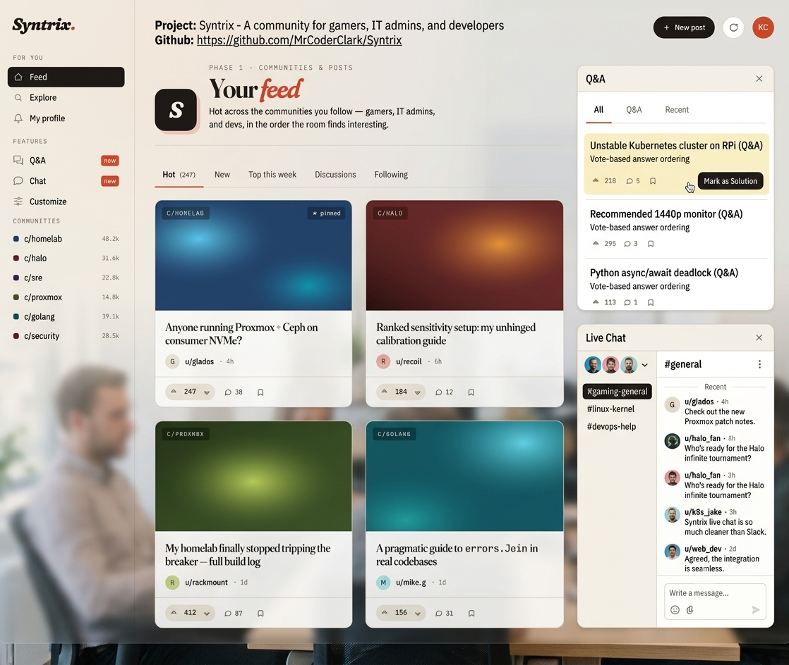

# Syntrix



A community web app for gamers, IT admins, and developers — Reddit + Stack
Overflow + Discord under one identity.

See `PRD.md` for the spec, `CLAUDE.md` for working conventions, and
`PROGRESS.md` for status.

## Quick start

**Prerequisites:**
- Python 3.12, Node 22, GNU Make
- `uv` (`pipx install uv`) and `pre-commit` (`pipx install pre-commit`)
- A running local Supabase stack (Postgres + Storage via Docker)

**One-time setup:**

```bash
cp .env.example .env
# Edit .env — set PG_USER, PG_PASSWORD to match your Supabase pooler.
cd backend && uv sync && cd ..
cd frontend && npm install && cd ..
make precommit-install
```

**Database bootstrap** (requires a running Supabase Docker stack):

```bash
# Set role passwords then bootstrap the syntrix schema:
export SYNTRIX_ADMIN_PASSWORD=changeme
export SYNTRIX_APP_PASSWORD=changeme
make db-bootstrap

# Run migrations (DDL goes directly to the Postgres container):
make db-migrate
```

> DDL (schema/table changes) must run via `docker exec` because the Supavisor
> pooler does not persist session-level DDL. Reads and DML go through the
> pooler normally (port 6543).

**Authentication setup:**

Syntrix uses OAuth-only authentication (no passwords). Register OAuth apps
with at least one provider:

- **GitHub:** https://github.com/settings/developers → New OAuth App
  - Callback URL: `http://127.0.0.1:8001/api/auth/callback/github`
- **Google:** https://console.cloud.google.com → Credentials → OAuth 2.0
  - Callback URL: `http://127.0.0.1:8001/api/auth/callback/google`
- **Discord:** https://discord.com/developers → New Application → OAuth2
  - Callback URL: `http://127.0.0.1:8001/api/auth/callback/discord`

Add the credentials to your `.env`:

```bash
JWT_SECRET_KEY=$(openssl rand -hex 32)
GITHUB_CLIENT_ID=...
GITHUB_CLIENT_SECRET=...
```

**Day-to-day:**

```bash
make dev          # start backend (:8001) + frontend (:3000) in foreground
make test         # backend tests
make lint         # ruff + eslint + prettier check
make fmt          # auto-format everything
make db-current   # show current Alembic revision
make db-history   # show migration history
```

- Backend: http://127.0.0.1:8001 — FastAPI, hot-reload on file changes
- Frontend: http://127.0.0.1:3000 — Next.js, hot-reload on file changes

## Video embeds

Posts support embedded video via the `▶` toolbar button in the editor.
The embed URL is rendered as an iframe on the post detail page.

**Allowed hosts:** YouTube, Vimeo, Twitch, Dailymotion, Streamable,
CodePen, CodeSandbox, and `localhost` / `127.0.0.1` (for local dev).

**Custom player color** (localhost video app):

```
<!-- Default indigo -->
http://localhost:3007/embed/<video-id>?color=indigo

<!-- Custom hex (URL-encoded #) -->
http://localhost:3007/embed/<video-id>?color=%23e8472b
```

The `color` query parameter sets the play button color. Use a named
color or a URL-encoded hex value (`%23` = `#`).

**Editing:** Double-click the embed placeholder in the editor to change
the URL.

## Layout

- `backend/` — Python + FastAPI ("the brain")
  - `app/` — application code (config, db, auth, routes)
  - `alembic/` — database migrations (all within `syntrix` schema)
  - `db/` — bootstrap/teardown SQL scripts
- `frontend/` — Next.js + React + TypeScript
  - `app/` — pages and layouts (App Router, `(app)` and `(auth)` route groups)
  - `components/shell/` — Shell, Sidebar, Topbar
  - `components/ui/` — Button, Avatar, Card, Tab, Input, PageHeader, VoteWidget, etc.
  - `components/` — Wordmark, icons
  - `lib/` — fonts, shared utilities
- `docs/superpowers/` — design artifacts (mockups, references)
- `.agent/plans/` — per-section implementation plans
